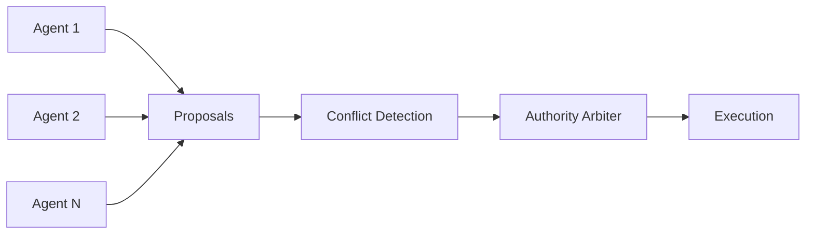
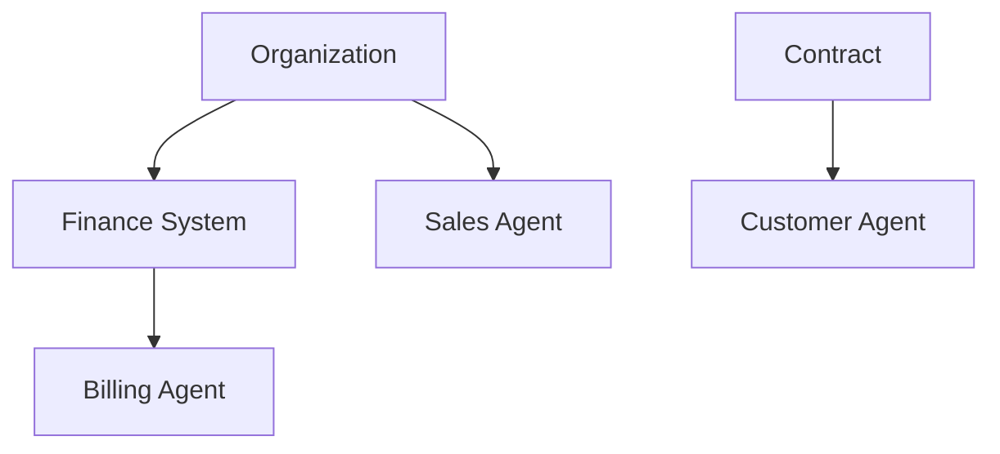

# Authority Arbiter

**Authority Arbiter** is a deterministic primitive that resolves conflicts in multi-agent systems using explicit authority, with consistent entity graph binding across agents, principals, and decisions.

It replaces negotiation, convergence, and optimization with precedence-based selection grounded in real-world structures.

This standard is introduced in *Authority is All You Need: Multi-Agent Conflict Resolution from Real-World Structures*.

---

## Overview

Multi-agent systems typically resolve conflicts through:

- negotiation
- iterative convergence
- optimization

Authority Arbiter takes a different approach:

> **Conflict is not solved through interaction. It is resolved through precedence.**

Instead of agents negotiating, the system selects the single winning action based on authority derived from real-world structures.

---

## Core Concept

Given a set of conflicting actions:

```
selected_action = argmax(authority(agent, context))
```

Authority is derived from:

- organizational hierarchy
- contractual relationships
- system-of-record ownership
- regulatory constraints

### Entity Consistency

Authority Arbiter ensures that agents, principals, and decisions are consistently represented across systems.

- Each agent maps to a real-world principal (organization, role, or contract party)
- Authority relationships are stable and context-aware
- The same inputs produce the same decision across systems

This makes every resolution:

- traceable
- explainable
- repeatable

---

## Why Authority Arbiter

| Problem | Traditional Systems | Authority Arbiter |
|---|---|---|
| Conflict resolution | Iterative | Deterministic |
| Latency | High | Low |
| Interpretability | Medium | High |
| Real-world alignment | Weak | Strong |

---

## When to Use Authority Arbiter

Use Authority Arbiter when:

- multiple agents can propose conflicting actions
- authority can be defined from real-world structures
- deterministic outcomes are required

Avoid using it when:

- no clear authority structure exists
- fully decentralized consensus is required

---

## Key Principles

- **Deterministic** — no randomness, no negotiation loops
- **Precedence-based** — authority defines resolution
- **Layered authority** — constitutional > institutional > system > agent
- **Domain-scoped** — authority applies within context
- **Bounded delegation** — no infinite authority stacking

---

## Architecture

### System Flow



### Authority Graph



- **Nodes** = agents mapped to principals
- **Edges** = authority relationships
- **Context** determines active authority

---

## Quick Example

### Scenario: Pricing Conflict

**Agents:**

- Sales Agent → proposes discount
- Billing Agent → enforces pricing rules
- Customer Agent → requests concession

**Resolution**

```
authority(Sales)    = 0.6
authority(Billing)  = 0.9
authority(Customer) = 0.4

→ selected = Billing
```

✔ No negotiation — ✔ No iteration — ✔ Deterministic outcome

---

## Example: Contract Amendment Conflict

A customer requests a change to payment terms mid-deal. Three agents have competing positions.

### Agents

- **Sales Agent** → accepts amended terms to close the deal
- **Legal Agent** → enforces standard compliance clauses
- **Finance Agent** → validates payment schedule against policy

### Authority Layers

| Layer | Authority |
|---|---|
| Regulatory | Minimum compliance clauses |
| Institutional | Finance payment policy |
| Agent | Sales discretion |

### Resolution

```
authority(Sales)   = 0.5   # discretionary, deal-motivated
authority(Legal)   = 0.85  # compliance-bound
authority(Finance) = 0.75  # policy-bound

→ selected = Legal
```

Sales proposes net-90 terms → rejected (violates minimum compliance clause)
Legal enforces net-30 with standard liability language.

No back-and-forth. No escalation loop. One resolution.

---

## Reference Implementation

```typescript
type Agent = string

function resolve(
  candidates: Agent[],
  authority: (agent: Agent) => number
): Agent {
  return candidates.reduce((best, current) =>
    authority(current) > authority(best) ? current : best
  )
}
```

---

## Authority Model

Authority is computed as:

```
A(agent, context) =
  hierarchy +
  contract +
  system_of_record +
  learned_signals
```

With constraints:

- higher layers override lower layers
- delegation must terminate
- domain scope must match

---

## Use Cases

- Billing and pricing systems
- Contract and approval workflows
- Infrastructure orchestration
- Autonomous agent coordination
- Resource allocation systems

---

## Repository Structure

```
authority-arbiter/
├── spec/        # formal definitions of authority and resolution
├── schema/      # authority graph schema
├── reference/   # minimal reference implementation
├── examples/    # real-world scenarios
├── docs/        # paper and supporting material
└── README.md
```

The repository is organized to separate specification, schema, implementation, and real-world examples.

---

## Reference Paper

*Authority is All You Need: Multi-Agent Conflict Resolution from Real-World Structures*

---

## Author

Created by **Gerald Neves** at [Scrums.com](https://www.scrums.com), Software Engineering Orchestration Platform (SEOP), orchestrating tools, teams and AI agents.

---

## License

Apache License 2.0
